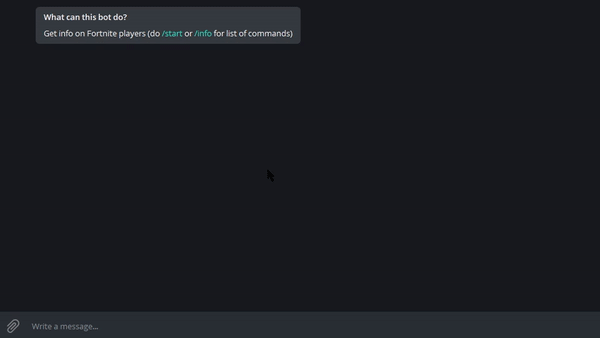
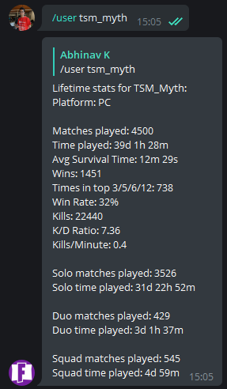
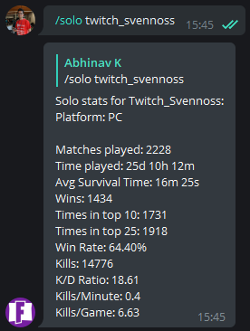
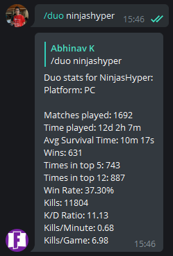
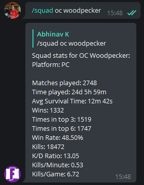

# fortnite-bot
Telegram and Discord bot that gets information on Fortnite players

Talk to [@fortnite_info_bot](https://t.me/fortnite_info_bot) on Telegram!

[Add the bot](https://discordapp.com/oauth2/authorize?client_id=435307828891090944&scope=bot) to your Discord server!

## Installation
1. Clone the repo to your computer.
    ```shell
    $ git clone https://github.com/abhinavk99/fortnite-bot.git
    $ cd fortnite-bot
    ```
2. Install the required dependencies with yarn or npm.
    ```shell
    # Installs all dependencies with yarn
    $ yarn install
    # If you don't want the dev dependencies
    $ yarn install --prod

    # OR

    # Installs all dependencies with npm
    $ npm install
    # If you don't want the dev dependencies
    $ npm install --only=prod
    ```
3. Go to [Fortnite Tracker API](https://fortnitetracker.com/site-api) and get an API key.
4. Get a Discord bot token from making a Bot User. [This tutorial](https://github.com/reactiflux/discord-irc/wiki/Creating-a-discord-bot-&-getting-a-token) should help.
5. Get a Telegram bot token from [@BotFather](https://t.me/BotFather).
6. [Start a Firebase project](https://console.firebase.google.com). This is used for caching Fortnite usernames for the `/set` command.
7. Create a file called `.env` in the repo directory.
8. Copy/paste the below into the file.
    ```ini
    TELEGRAM_TOKEN=Token here
    FORTNITE_KEY=Key here
    DISCORD_TOKEN=Token here
    FIREBASE_KEY=Key here
    FIREBASE_DOMAIN=your-project-id.firebaseapp.com
    FIREBASE_URL=https://your-project-id.firebaseio.com
    FIREBASE_ID=your-project-id
    FIREBASE_BUCKET=your-project-id.appspot.com
    ```
9. Put your tokens and key where it says to in the config. Do not put quotes around the tokens.
10. Run the bot.
    ```shell
    $ npm start
    ```

## Testing

```shell
# Requires dev dependencies to be installed
$ npm test
```

## Commands

### Global Commands
Do `/start`, `/help`, or `/info` to get a list of commands from the bot.

| Command | Description | Usage |
| --- | --- | --- |
| /user | Get global stats for a player | /user `<username>` |
| /pc | Get global stats for a PC player | /pc `<username>` |
| /xbox | Get global stats for an XBOX player | /xbox `<username>` |
| /ps4 | Get global stats for a PS4 player | /ps4 `<username>` |
| /season8 or /s8 | Get all season 8 stats for a player | /season8 `<username>` |

### Modes Commands
| Command | Description | Usage |
| --- | --- | --- |
| /solo | Get lifetime solo stats for a player | /solo `<username>` |
| /duo | Get lifetime duo stats for a player | /duo `<username>` |
| /squad | Get lifetime squad stats for a player | /squad `<username>` |
| /solos8 | Get season 8 solo stats for a player | /solos8 `<username>` |
| /duos8 | Get season 8 duo stats for a player | /duos8 `<username>` |
| /squads8 | Get season 8 squad stats for a player | /squads8 `<username>` |

### Other Commands
| Command | Description | Usage |
| --- | --- | --- |
| /recent | Get recent match stats for a player | /recent `<username>` |
| /rold | Get recent match stats for a player (old format) | /rold `<username>` |
| /compare | Compare two players | /compare `<username1>, <username2>` |
| /rating | Get TRN rating stats for a player | /rating `<username>` |
| /kd | Get K/D ratio stats for a player | /kd `<username>` |
| /winrate or /wr | Get win rate stats for a player | /winrate `<username>` |
| /set | Set username to your messaging account | /set `<username>` |
| /leaderboards | Get leaderboard data | /leaderboards |
| /challenges | Get current weekly challenges | /challenges |
| /store | Get current store items | /store |
| /matches | Get match history | /matches `<username>` |

### Deprecated Commands
| Command | Description | Usage |
| --- | --- | --- |
| /season3 or /s3 | Get all season 3 stats for a player | /season3 `<username>` |
| /solos3 | Get season 3 solo stats for a player | /solos3 `<username>` |
| /duos3 | Get season 3 duo stats for a player | /duos3 `<username>` |
| /squads3 | Get season 3 squad stats for a player | /squads3 `<username>` |
| /season4 or /s4 | Get all season 4 stats for a player | /season4 `<username>` |
| /solos4 | Get season 4 solo stats for a player | /solos4 `<username>` |
| /duos4 | Get season 4 duo stats for a player | /duos4 `<username>` |
| /squads4 | Get season 4 squad stats for a player | /squads4 `<username>` |
| /season5 or /s5 | Get all season 5 stats for a player | /season5 `<username>` |
| /solos5 | Get season 5 solo stats for a player | /solos5 `<username>` |
| /duos5 | Get season 5 duo stats for a player | /duos5 `<username>` |
| /squads5 | Get season 5 squad stats for a player | /squads5 `<username>` |
| /season6 or /s6 | Get all season 6 stats for a player | /season6 `<username>` |
| /solos6 | Get season 6 solo stats for a player | /solos6 `<username>` |
| /duos6 | Get season 6 duo stats for a player | /duos6 `<username>` |
| /squads6 | Get season 6 squad stats for a player | /squads6 `<username>` |
| /season7 or /s7 | Get all season 7 stats for a player | /season7 `<username>` |
| /solos7 | Get season 7 solo stats for a player | /solos7 `<username>` |
| /duos7 | Get season 7 duo stats for a player | /duos7 `<username>` |
| /squads7 | Get season 7 squad stats for a player | /squads7 `<username>` |

#### Optional Platform Flags

You can end any command (except `/set`, `/pc`, `/xbox`, `/ps4`, `/compare`, `/leaderboards`, `/challenges`, and `/store`) with `pc`, `xbox`, or `ps4` to specify the platform
to search for the user.

```
Example:

/duopc ninja
/squads4ps4 AlexRamiGaming
```

#### Instructions for special /set command
1. Message the bot `/set yourusername`.
    ```
    Example:

    /set ninja
    ```
2. Use any of the above commands (except `/set`) without your username.
    ```
    Example:

    /user
    /squads3
    /recent
    /compare TSM_Myth
    ```
3. The bot will use the username that you set with `/set yourusername` for your stats.

#### Demo of /set


## Examples





## Contributing

Contributions are greatly appreciated!

```shell
# 1. Fork the bot and clone it to your computer
$ git clone https://github.com/your-username/fortnite-bot.git
$ cd fortnite-bot

# 2. Connect your fork with this repo to stay up to date on any changes
$ git remote add upstream https://github.com/abhinavk99/fortnite-bot.git

# 3. Make your feature branch
$ git checkout -b new-feature

# 4. Add and commit the changes you made
$ git add .
$ git commit -m "Added new feature"

# 5. Push to your branch
$ git push origin new-feature

# 6. Create a pull request on GitHub
```

Alternatively, feel free to open [an issue](https://github.com/abhinavk99/fortnite-bot/issues).

## Releases
Go to the changelog [here](CHANGELOG.md)! Releases start at v2.0.1 because I didn't know how to use git tags before then and never updated version numbers in `package.json`.

## Dependencies
Powered by [Fortnite Tracker API](https://fortnitetracker.com/site-api) and [fortnite.js](https://github.com/ickerio/fortnite.js).
